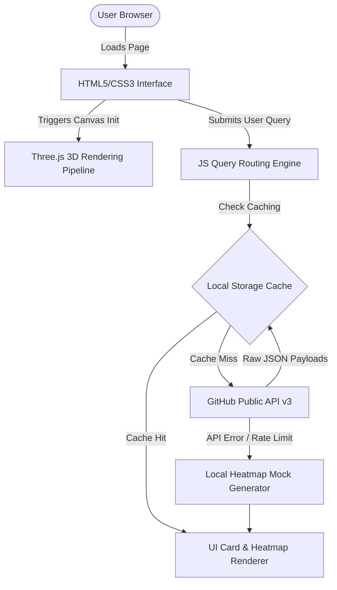

# 🏗️ Xaytheon System Architecture & Design Overview

This document provides a deep architectural breakdown of the Xaytheon platform, explaining the frontend pipeline, interactive 3D rendering loops, state management strategies, API interactions, and local persistence.

## Table of Contents

- [1. High-Level Architectural Flow](#1-high-level-architectural-flow)
- [2. Component Decoupling & Directory Map](#2-component-decoupling--directory-map)
- [3. 3D Graphics Pipeline (Three.js Loop)](#3-3d-graphics-pipeline-threejs-loop)
- [4. API Caching & Rate-Limit Resiliency](#4-api-caching--rate-limit-resiliency)

---

## 1. High-Level Architectural Flow

---

## 2. Component Decoupling & Directory Map

Xaytheon follows a strict modular structure to isolate responsibilities:

- **Routing & Views (`*.html`)**: High-fidelity markup files that serve as target views.
- **Visual Design (`style.css`)**: Centralized design system with structured variables, responsive fluid grid layouts, and custom media queries.
- **Three.js Pipeline (`script.js` / Part 1)**: Coordinates the 3D canvas backdrop, lighting models, orbital controls, and real-time custom environment adjustments.
- **Analytics Engine (`analytics.js`)**: Real-time graphing mechanisms (using Chart.js) that process growth velocity, language distribution, and coordinate JSON/CSV data downloads.
- **Watchlist Caching (`community.js` / `explore.js`)**: Manages the persistence of user-pinned/saved repositories inside the local environment using serialized `localStorage`.

---

## 3. 3D Graphics Pipeline (Three.js Loop)

The platform draws a dynamic, interactive 3D background canvas which passes click/scroll inputs through to underlying layers:

1. **Initialization (`init()`)**: Prepares a `THREE.Scene`, standard `THREE.PerspectiveCamera` (fov 75), and `THREE.WebGLRenderer` (alpha enabled).
2. **Lighting Architecture (`addLights()`)**:
   - `AmbientLight` for base ambient illumination.
   - Dual `DirectionalLight` to model sunrays and primary shadows.
   - Reddish `PointLight` to cast atmospheric micro-glows.
3. **Geometry Fallback Loop**: Tries to load `prism.glb` via a standard `GLTFLoader`. If local assets fail (common during quick offline onboarding), it catches the exception and falls back to rendering a mathematically perfect `THREE.OctahedronGeometry`.
4. **Animation Rendering (`animate()`)**: Toggles rotators using requestAnimationFrame, updating the Euler angles of active meshes continuously based on `autoRotationSpeed` variables.

---

## 4. API Caching & Rate-Limit Resiliency

To shield the application from GitHub's strict public API rate limits (60 queries/hour for unauthenticated sessions):

- **Query Deduplication Cache**: Remembers all successfully loaded results for up to 5 minutes using an in-memory dictionary `searchCache`.
- **LocalStorage Profile Persistence**: Saves active usernames and pinned lists (`xaytheon:watchlist`) locally, avoiding redundant REST queries on subsequent page navigations.
- **Degraded Fallback Rendering**: If a GitHub API call fails with status code 403 (Rate Limit Reached), the application catches the error and generates approximate heatmaps locally so the layout remains intact.

---
*Created by senior open-source contributors for Xaytheon.* 🚀
